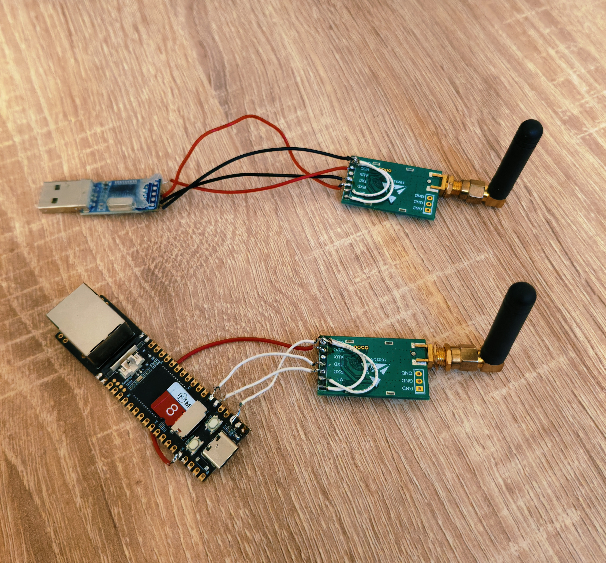
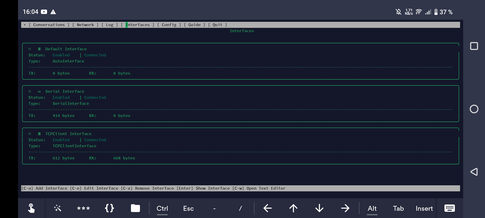
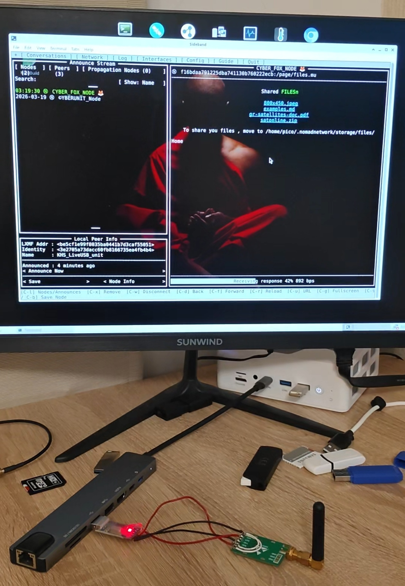
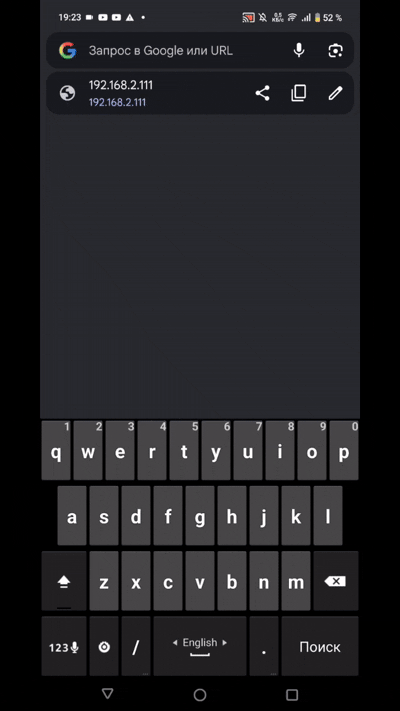
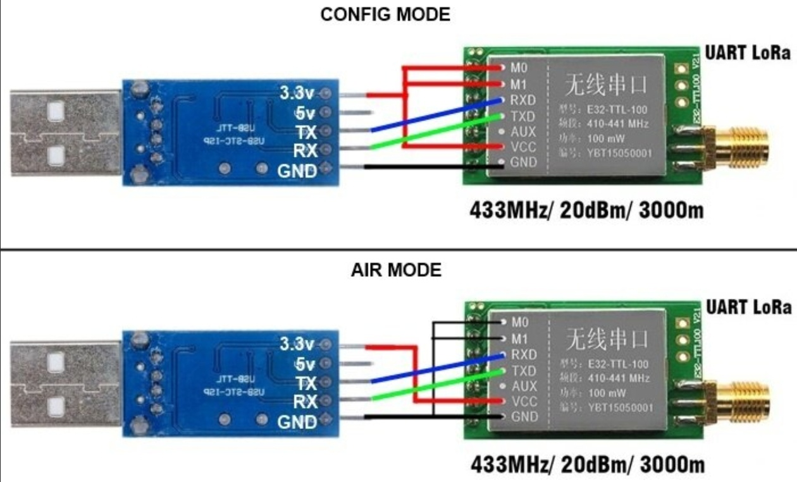
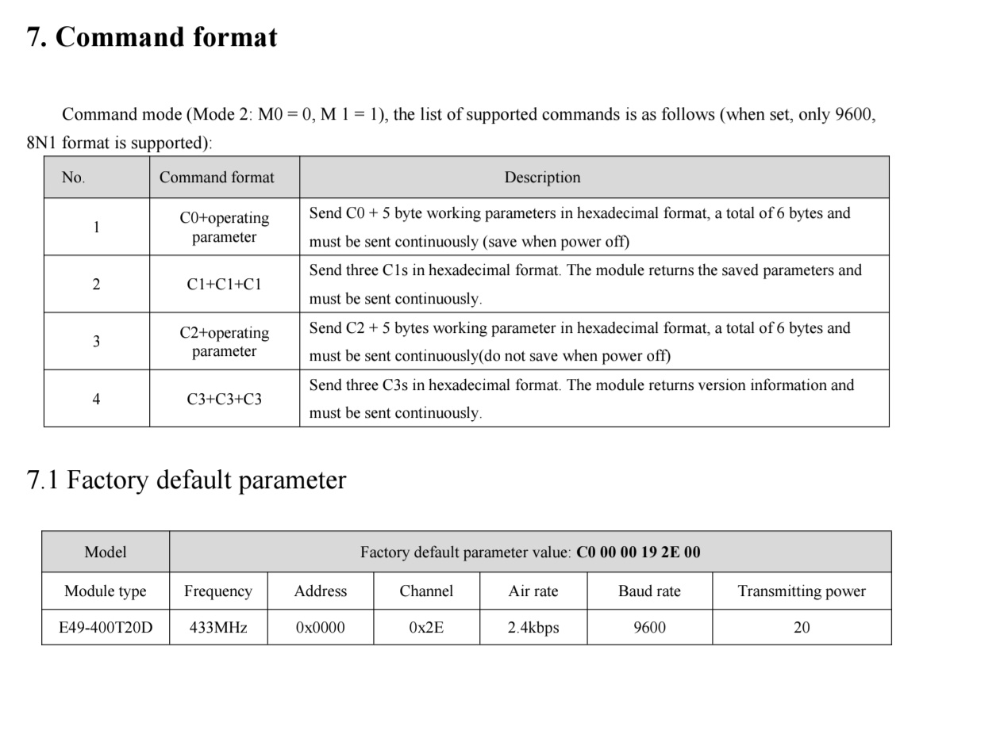
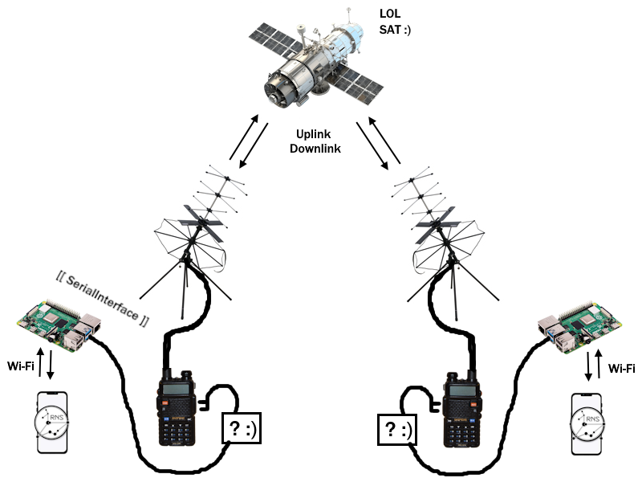

# KHSLiveUSB
Neuro Reticulum LiveUSB image 

```php
  _  ___    _  _____ 
 | |/ / |  | |/ ____|
 | ' /| |__| | (___  
 |  < |  __  |\___ \ 
 | . \| |  | |____) |
 | |\_\_|  |_|_____/ 
 | |
 | |.   ,--()
 | ( )-'-.------|>
 | |`     `--[]       
 | |___   _____      
 | | \ \ / / _ \     
 | | |\ V /  __/     
 |_|_| \_/ \___|

```

The KHSLiveUSB image is built on Debian 13 Trixie with Xfce and kernel 6.12 for the AMD64 architecture.

It is designed for standalone operation on PCs with moderate to high computing power, PCs and mini PCs without SSDs or HDDs, and for operation in conditions with partial or no internet connection, with the ability to locally run lightweight neural network models and establish communication via Reticulum.


Download: HF link https://huggingface.co/cyberunit/KHSLiveUSB

# AND

# CYBERFOX Reticulum NODE powered by LuckFox pico PRO Max based on Ubuntu 22.04




## Interfaces

## Download files from Node

## INSTALL:
- Download image foximage_armv7l_0.4.bin ( https://huggingface.co/cyberunit/KHSLiveUSB/tree/main )
- Write to 8Gb MicroSD Card
```php
dd if=cyberfox_armv7l.iso of=/dev/sd? bs=1M status=progress
```
where ? = youre MicroSD Card

>SSH
Default ip: 192.168.2.111<br/>
Default login: pico<br/>
Default pass: luckfox<br/>

>Web-interface (View Only)
http://192.168.2.111/index.php

>Configs
ReticulumCFG = ~/.reticulum/config<br/>
NodeCFG = ~/.nomadnetwork/config




Example Node pages 
https://github.com/sw3nlab/KHSLiveUSB/tree/main/reticulum_node_example


Tested on E-byte E49 UART Radio Trancievers
`C1 C1 C1 = c0 00 00 3f 2e 00`


## Reticulum Sattelite Communications Concept


## Donate: 
https://dzen.ru/cyberunit?donate=true
