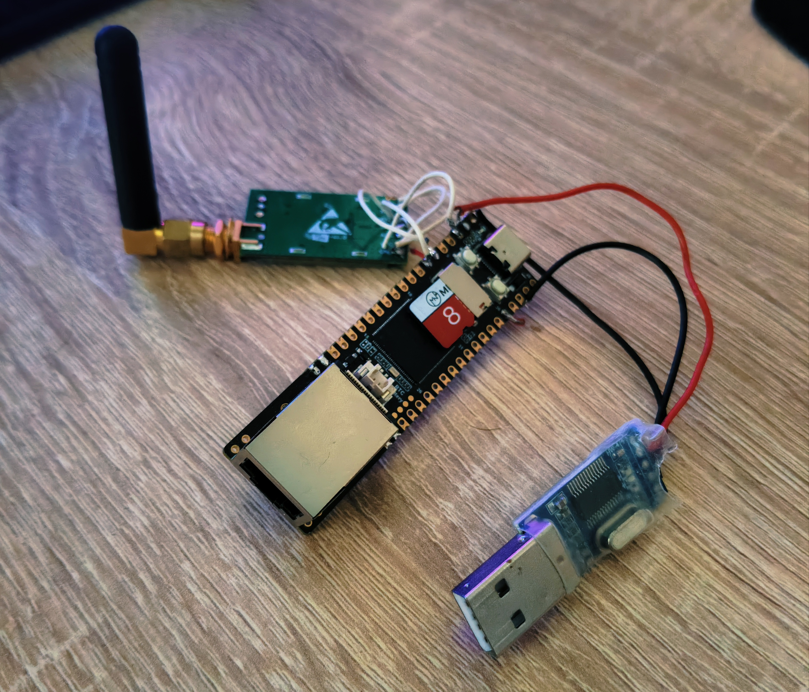
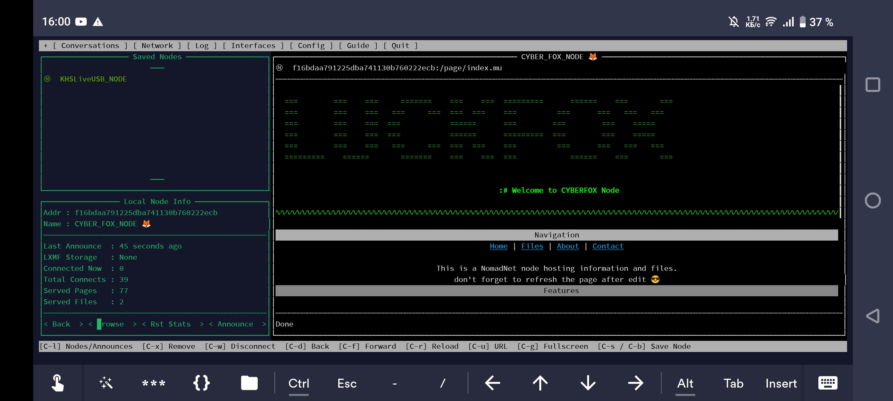

# KHSLiveUSB
Neuro Reticulum LiveUSB image 

```php
  _  ___    _  _____ 
 | |/ / |  | |/ ____|
 | ' /| |__| | (___  
 |  < |  __  |\___ \ 
 | . \| |  | |____) |
 | |\_\_|  |_|_____/ 
 | (_)               
 | |___   _____      
 | | \ \ / / _ \     
 | | |\ V /  __/     
 |_|_| \_/ \___|     
```

The KHSLiveUSB image is built on Debian 13 Trixie with Xfce and kernel 6.12 for the AMD64 architecture.

It is designed for standalone operation on PCs with moderate to high computing power, PCs and mini PCs without SSDs or HDDs, and for operation in conditions with partial or no internet connection, with the ability to locally run lightweight neural network models and establish communication via Reticulum.


Download: HF link https://huggingface.co/cyberunit/KHSLiveUSB


#CYBERFOX_Reticulum_NODE powered by LuckFox pico PRO Max based on Ubuntu 22.04






![image]images/interfaces.jpg)

INSTALL:
- UPLOAD image cyberfox_armv7l.iso 
- Write to 8Gb MicroSD Card
```php
dd if=cyberfox_armv7l.iso of=/dev/sd? bs=1M status=progress
```
where ? = youre MicroSD Card

>SSH
Default ip: 192.168.2.111

Default login: pico

Default pass: luckfox

>Check configs and start Node
ReticulumCFG = ~/.reticulum/config

NodeCFG = ~/.nomadnetwork/config

Start Node Pseudo-GUI
```php
nomadnet
```

Star Node Daemon (no GUI)
```php
nomadnet -d
```
